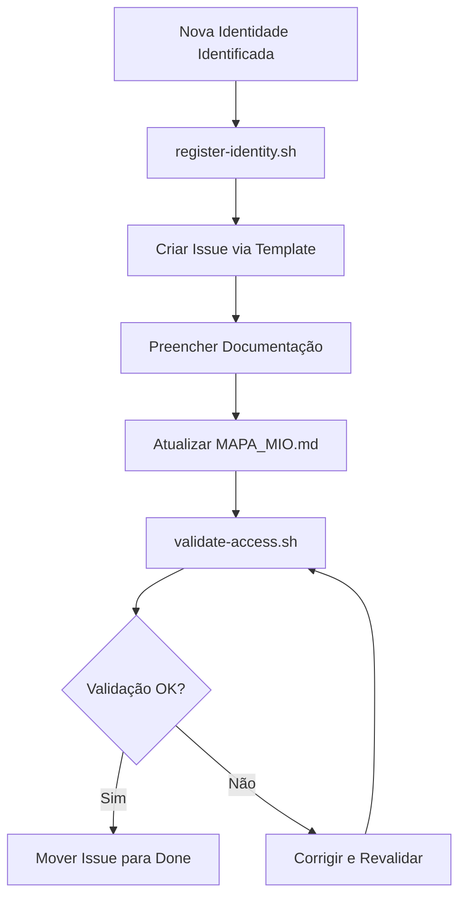

# ✅ Próximos Passos - Sistema MIO

## 📋 Checklist da Issue #1

### ✅ Concluído
- [x] GitHub Deploy Key migrada
- [x] Railway Deploy migrada
- [x] Cursor AI migrada
- [x] GitHub Project criado
- [x] Issue #1 criada e vinculada ao Project
- [x] GitHub Actions workflow criado

### 🔄 Em Progresso / Próximos

#### 1. Validar Todas Identidades
```bash
cd /Users/nettomello/CODIGOS/bots_ia/mio-system
./identities/scripts/validate-access.sh
```

**Status:** ⏳ Pendente  
**Ação:** Executar validação local

---

#### 2. Atualizar MAPA_MIO.md
- [ ] Marcar identidades migradas como ✅ Ativas
- [ ] Atualizar estatísticas
- [ ] Adicionar notas sobre migração

**Status:** ⏳ Pendente  
**Ação:** Editar `identities/MAPA_MIO.md`

---

#### 3. Configurar GitHub Actions
- [x] Workflow criado (`validate-identities.yml`)
- [x] Caminhos corrigidos
- [ ] Testar workflow manualmente

**Status:** ✅ Criado, ⏳ Testar  
**Ação:** 
```bash
# Testar workflow manualmente
gh workflow run validate-identities.yml
```

---

#### 4. Ativar Branch Protection
- [ ] Configurar regras para `main`
- [ ] Require pull request reviews
- [ ] Require status checks (validate-identities)

**Status:** ⏳ Pendente  
**Ação:** Via GitHub Settings → Branches

---

## 🚀 Expansões Futuras

### Identidades Planejadas

1. **GitHub PAT CI** (`github-pat-ci`)
   - Tipo: Personal Access Token
   - Uso: PRs automatizados, GitHub Actions
   - Prioridade: Medium

2. **Vercel Deploy** (`vercel-deploy`)
   - Tipo: Deploy Key/Token
   - Uso: Deploy frontend/APIs
   - Prioridade: Low

3. **MCP DevOps Agent** (`mcp-devops`)
   - Tipo: MCP Agent
   - Escopo: Branches `dev/*`
   - Prioridade: Medium

4. **LangChain Analyst Bot** (`langchain-analyst`)
   - Tipo: LangChain Bot
   - Função: Análise de código
   - Prioridade: Low

---

## 📝 Como Adicionar Nova Identidade

### Via Script (Recomendado)
```bash
./scripts/register-identity.sh {tipo} {nome} {plataforma}

# Exemplo:
./scripts/register-identity.sh deploy-key vercel-deploy vercel
```

### Via Issue Template
1. Criar nova issue usando template `nova-identidade.md`
2. Preencher metadados
3. Seguir checklist da issue
4. Adicionar ao Project

---

## 🔄 Workflow Operacional



---

## 📊 Métricas de Sucesso

- ✅ 3 identidades migradas
- ⏳ 0 identidades validadas
- ⏳ 0 novas identidades adicionadas
- ✅ 1 Project criado
- ✅ 1 Issue criada
- ✅ 1 Workflow configurado

---

**Última atualização:** 2025-12-03

