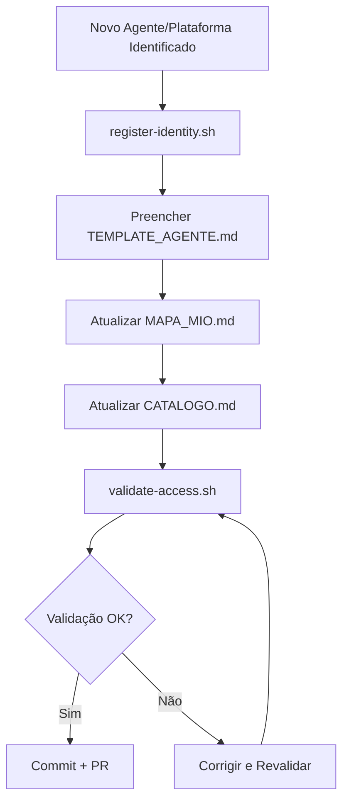

# 🗺️ Mapa de Identidades Operacionais

> **Painel de Inteligência Operativa** - Visão dinâmica do ecossistema de agentes e plataformas

**Última atualização:** 2025-12-03  
**Status geral:** 🟢 Operacional  
**Migração concluída:** ✅ Todas identidades do flowcloser migradas e validadas

---

## 📊 Visão Geral

| Categoria | Total | Ativas | Pendentes | Planejadas |
|-----------|-------|--------|-----------|------------|
| **Plataformas** | 2 | 2 | 0 | 3 |
| **Agentes IA** | 1 | 1 | 0 | 2 |
| **Deploy Keys** | 1 | 1 | 0 | 2 |
| **Total** | 4 | 3 | 0 | 7 |

> **Nota:** 3 identidades ativas migradas do projeto flowcloser e validadas em 2025-12-03

---

## 🔧 Plataformas de Código & Versionamento

### GitHub

- [x] **flowcloser-deploy** → Deploy key SSH para produção
  - Status: ✅ Ativa
  - Repo: `kauntdewn1/flowcloser-agent`
  - Permissões: Read/Write
  - Documentação: `github/deploy-keys/flowcloser-deploy.md`

- [ ] **github-pat-ci** → Personal Access Token para CI/CD
  - Status: ⏳ Planejado
  - Uso: PRs automatizados, GitHub Actions
  - Escopo: `repo`, `workflow`

- [ ] **github-app-agent** → GitHub App com escopo limitado
  - Status: ⏳ Planejado
  - Uso: Automações avançadas, webhooks
  - Escopo: A definir

### GitLab

- [ ] **gitlab-deploy-key** → Deploy key para GitLab (se necessário)
  - Status: ⏳ Planejado
  - Uso: Repositórios GitLab

### Bitbucket

- [ ] **bitbucket-app-password** → App Password (se necessário)
  - Status: ⏳ Planejado

---

## 🚀 Plataformas de Deploy & CI/CD

### Railway

- [x] **railway-production** → Integração GitHub → Railway
  - Status: ✅ Ativo
  - Projeto: `flowcloser-agent-production`
  - Auto-deploy: `main` branch
  - Documentação: `railway/railway-deploy.md`

### Vercel

- [ ] **vercel-deploy** → Deploy key/token para Vercel
  - Status: ⏳ Planejado
  - Uso: Deploy frontend/APIs
  - Tipo: Token ou Deploy Key

### Netlify

- [ ] **netlify-token** → Token para Netlify
  - Status: ⏳ Planejado
  - Uso: Deploy estático/funções serverless

### Render

- [ ] **render-api-key** → API Key para Render
  - Status: ⏳ Planejado

### Fly.io

- [ ] **fly-api-token** → Token para Fly.io
  - Status: ⏳ Planejado

### Cloudflare Pages

- [ ] **cloudflare-api-token** → Token para Cloudflare
  - Status: ⏳ Planejado

---

## 🤖 Agentes/IA que Interagem com Código

### Cursor AI

- [x] **cursor-github** → Integração Cursor → GitHub
  - Status: ✅ Ativo
  - Tipo: OAuth/Token
  - Escopo: Desenvolvimento local
  - Documentação: `agents/cursor/cursor-github.md`

### MCP Agents

- [ ] **mcp-autodev** → Agente MCP para desenvolvimento
  - Status: ⏳ Planejado
  - Escopo: Branches `dev/*`
  - Permissões: Push, PR creation
  - Framework: Model Context Protocol

- [ ] **mcp-devops** → Agente MCP para DevOps
  - Status: ⏳ Planejado
  - Escopo: CI/CD, deployments
  - Permissões: Deploy, monitoramento

### LangChain Bots

- [ ] **langchain-analyst** → Bot analítico LangChain
  - Status: ⏳ Planejado
  - Função: Análise de código, métricas
  - Permissões: Read-only

- [ ] **langchain-code-reviewer** → Bot de code review
  - Status: ⏳ Planejado
  - Função: Revisão automática de PRs
  - Permissões: Read, comment

### Outros Agentes

- [ ] **github-copilot** → GitHub Copilot (se ativo)
  - Status: ⏳ Planejado
  - Tipo: Passivo (mas pode logar)

- [ ] **replit-ghostwriter** → Replit Ghostwriter (se ativo)
  - Status: ⏳ Planejado

---

## 🛡️ Plataformas com Verificação de Segurança

### Meta (Facebook)

- [ ] **meta-app-token** → Token para Meta Apps
  - Status: ⏳ Planejado
  - Uso: Integração Instagram/WhatsApp
  - Tipo: App Access Token

### AWS

- [ ] **aws-iam-role** → IAM Role para deploy
  - Status: ⏳ Planejado
  - Uso: Deploy em AWS
  - Tipo: IAM Role + OIDC

### GCP

- [ ] **gcp-service-account** → Service Account
  - Status: ⏳ Planejado
  - Uso: Deploy em GCP

---

## 📈 Roadmap de Expansão

### Q1 2025
- [ ] Completar identidades GitHub (PAT, App)
- [ ] Adicionar Vercel e Netlify
- [ ] Criar primeiro MCP agent

### Q2 2025
- [ ] Implementar LangChain bots
- [ ] Adicionar AWS/GCP
- [ ] Automação de validação

### Q3 2025
- [ ] Dashboard de status
- [ ] Rotação automática de tokens
- [ ] Integração com secret managers

---

## 🔄 Fluxo de Adição de Nova Identidade

---

## 📝 Legenda de Status

- ✅ **Ativo** - Identidade configurada e funcionando
- ⏳ **Planejado** - Identificado, mas não implementado
- 🔄 **Em Progresso** - Em implementação
- ⚠️ **Pendente** - Criada, mas aguardando configuração
- ❌ **Inativo** - Desabilitada ou removida

---

**Nota:** Este mapa é atualizado dinamicamente conforme novas identidades são adicionadas ao sistema.

---

## 📦 Histórico de Migração

### Migração Inicial (2025-12-03)

**Projeto origem:** `flowcloser-agent`  
**Repositório destino:** `mio-system`

**Identidades migradas:**
- ✅ **flowcloser-deploy** (GitHub Deploy Key) - Migrada e validada
- ✅ **railway-production** (Railway Deploy) - Migrada e validada  
- ✅ **cursor-github** (Cursor AI) - Migrada e validada

**Validação:**
- GitHub CLI: ✅ Autenticado
- Railway CLI: ✅ Autenticado
- SSH: ⏭️ Validação pulada (passphrase não disponível)

**Status:** Todas identidades migradas com sucesso e documentadas no novo repositório dedicado.

